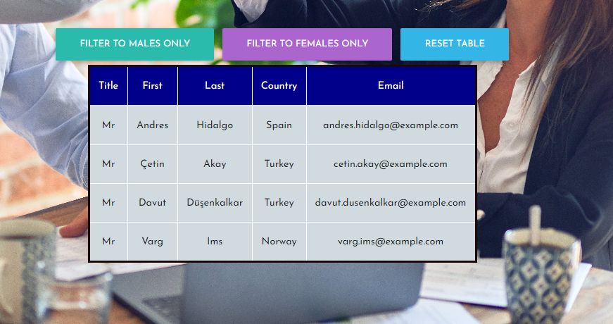
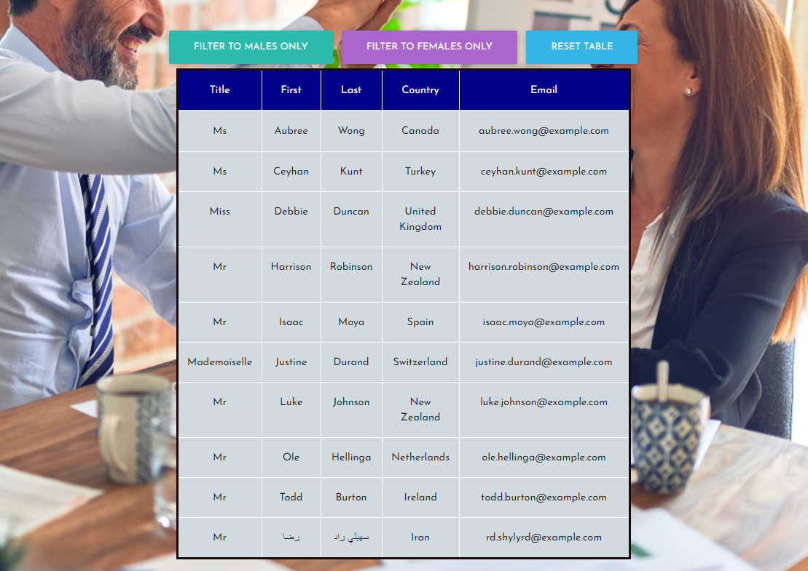

# Project: React: Employee Directory

  Deployed Site Link - > https://new-react-employee-directory.herokuapp.com/

## Table of Contents: 
- [Project: React: Employee Directory](#project-react-employee-directory)
  - [Table of Contents:](#table-of-contents)
  - [License:](#license)
  - [Description:](#description)
  - [Installation Instructions:](#installation-instructions)
  - [Test Command:](#test-command)
  - [Github:](#github)
  - [My Email Address:](#my-email-address)
  - [Other Contributors:](#other-contributors)
  - [Images:](#images)

## License:

## Description:
Create an employee directory with React. This will require you to break up your application's UI into components, manage component state, and respond to user events.

User Story -
* As a user, I want to be able to view my entire employee directory at once so that I have quick access to their information.

Business Context -
* An employee or manager would benefit greatly from being able to view non-sensitive data about other employees. It would be particularly helpful to be able to filter employees by name.

## Installation Instructions: 
1) npm i on App.js

## Test Command: 
To test filter type male or female into input box and click button - be sure to refresh page with refresh button after done with the filtered information.

To sort simply click any header text to sort the entire table by that column alphabetically.

## Github: 
Check out more projects on my Github at https://github.com/ReindeerCode

## My Email Address:
If you have any questions please feel free to email me at ReindeerCode@gmail.com

## Other Contributors:
Collaborated with https://github.com/arensalmela

## Images:

Following screen shot is of the home screen

Following screen shot is showing filter by male

Following screen shot is showing sort by first name

